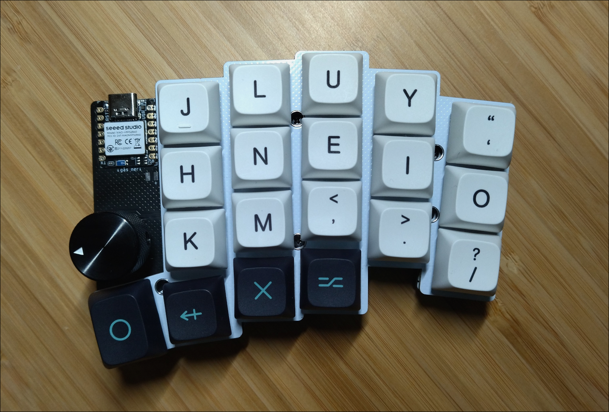
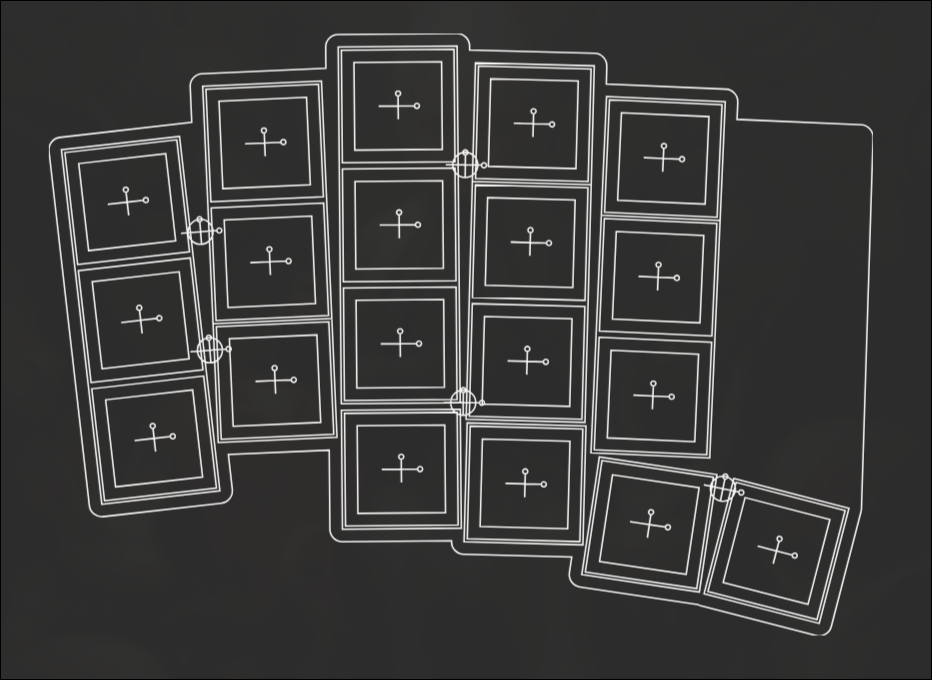
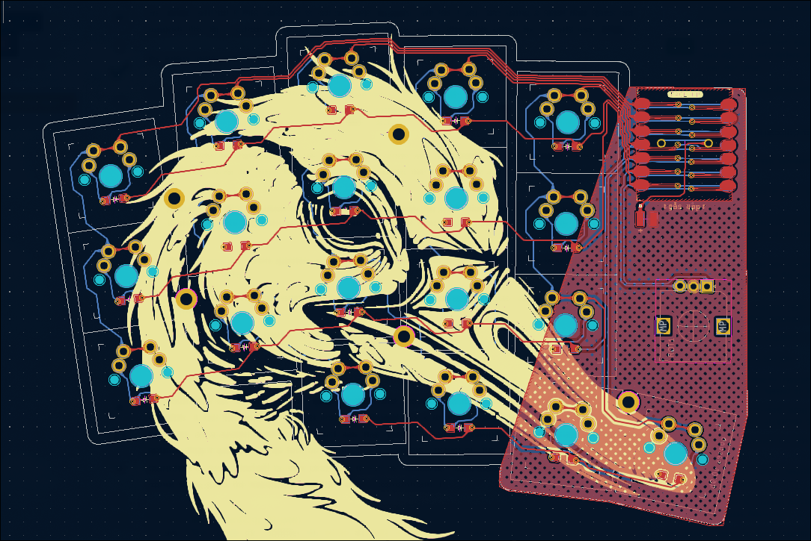

# Goose  38-key split wireless keyboard
Goose is a keyboard built with the help of [Ergogen](https://github.com/ergogen/ergogen).
This means that it's really simple to edit */config.yaml* and generate your own design, stagger and splay.
The KiCad PCBs are located in *pcb/* and contains the pcb, plate and bottom boards.
Use them to either manufacture directly or take leads from how I routed the pcb if you create your own. 

## Description
Wireless 38-key split and reversible keyboard with two rotary encoders, no support for button/press on these.
Plate is optional, but I'm using 3-pin switches which does almost make plates mandatory.
Batteries soldered directly to PCB, bought batteries with protection against shorts.
All PCBs are reversible.

Stagger and splay according to my hands, helped by [Ergopad](https://pashutk.com/ergopad/).
Artwork generated with Midjourney AI. Not really gooses but goose-like? :D

## Images
Final, completed, keyboard (left side).

Ergogen generated layout.

Routed PCB, KiCad preview.

## Materials
- 2 x Xiao Seeed nRF52840
- 2 x EC12 rotary encoders
- 2 x Knobs for rotary encoder
- 38 x Cherry MX switches
- 38 x SOD-123 Diodes
- 2 x LiPo batteries

## Firmware
ZMK firmware for wireless support. Contained in *firmware/*, includes build-script.
